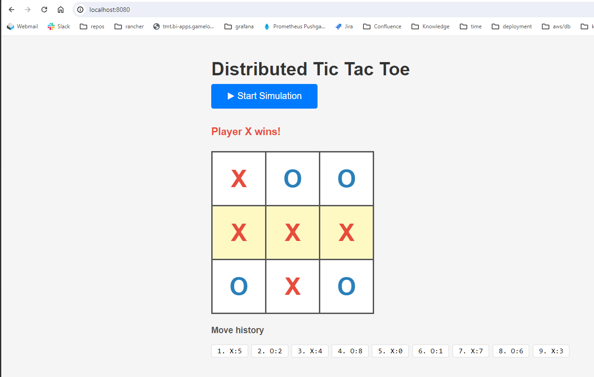

## Services

| Module | Port | Role |
|---|---|---|
| `config-server` | 8888 | Spring Cloud Config Server (git backend) |
| `eureka-server` | 8761 | Netflix Eureka service registry |
| `gateway` | 8080 | Spring Cloud Gateway MVC |
| `game-engine-service-app` | 8081 | Board logic, moves, win detection |
| `game-session-service-app` | 8082 | Session management, simulation loop |
| `ui-service-app` | 8083 | Static frontend |
| `configuration` | — | YAML config files served by config-server |

---

## Running Locally

```bash
docker compose up --build -d
```

Open **http://localhost:8080** when all services are up



Stop everything with:

```bash
docker compose down
```

---

## Optional Enhancements

### ✅ Virtual threads

### ✅ Real-Time Updates via SSE
`POST /sessions/{id}/simulate` keeps the HTTP connection open and pushes individual `move` SSE events as the simulation progresses


### ✅ Concurrency Safeguards
- **`Game` entity** — `@Version` for optimistic locking.
- **`Session` entity** — `@Version` + `@Transactional` + `saveAndFlush()` on `simulate()` prevents two concurrent requests from starting the same simulation.

### ✅ Data Persistence
Both services default to H2 in-memory. PostgresQL is supported when running with `SPRING_PROFILES_ACTIVE=prod`. Requires a running Postgres container.
Prod config files stored in `configuration/` module.

### ✅ Service Discovery / API Gateway:
Gateway, service discovery (Eureka) & Config server deployed as separate services 

---

## Testing & Validation:

### Integration Testing
Integration tests per each BE service: GameEngineItTest & GameSessionIT
Also added app context and unit tests
Added section in DISCUSSION.md for E2E test thoughts

```bash
mvn test -f game-engine-service-app/pom.xml
mvn test -f game-session-service-app/pom.xml
```

### Error Handling
Added centralized GlobalExceptionHandler